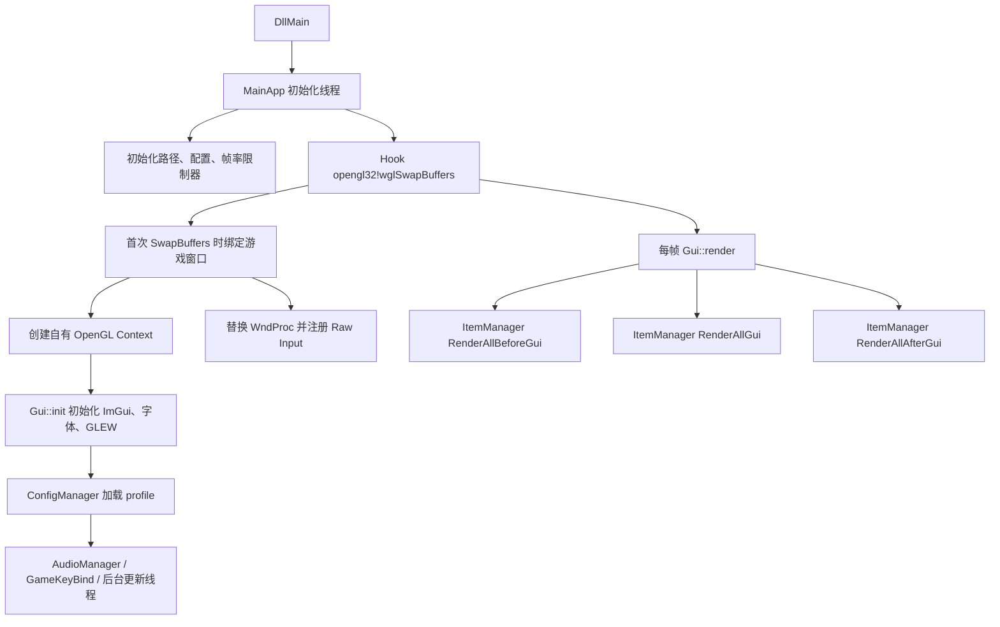
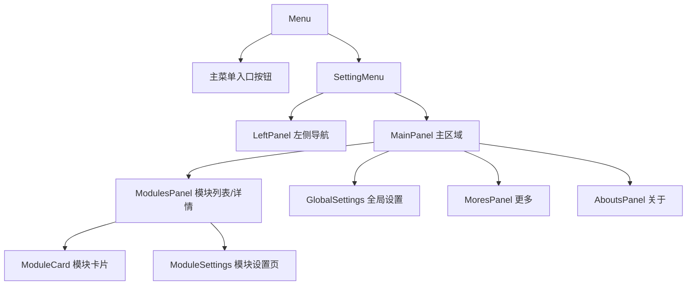

# InfiniteGUI-DLL 项目架构总结

更新日期：2026-06-15

## 1. 项目定位

InfiniteGUI-DLL 是一个用于注入 Java 版 Minecraft 的 Windows C++ DLL。它通过 Hook OpenGL 的 `wglSwapBuffers`，在游戏画面上叠加 ImGui 绘制的 HUD、菜单和视觉效果。

项目主要目标：

- 在 Minecraft 游戏窗口中绘制实时 HUD。
- 提供可视化菜单，用于管理 HUD 模块和全局设置。
- 支持配置文件、字体、音效、窗口样式、快捷键等用户自定义能力。
- 支持部分外部数据源，例如 B 站粉丝数、直播弹幕日志、系统媒体信息。
- 支持少量输入辅助功能，例如强制疾跑、自动消息。

核心依赖：

- Windows API / WinHTTP / WinRT
- OpenGL / GLEW
- Dear ImGui
- nlohmann/json
- stb_image
- miniaudio
- Detours/TitanHook

## 2. 顶层运行链路

关键文件：

- `InfiniteGUI-DLL/dllmain.cpp`：DLL 入口，创建 `MainApp` 线程。
- `InfiniteGUI-DLL/Init.hpp`：主初始化流程、后台更新线程、卸载流程。
- `InfiniteGUI-DLL/opengl_hook.cpp`：OpenGL Hook、WndProc Hook、Raw Input、窗口/上下文生命周期。
- `InfiniteGUI-DLL/gui.cpp`：ImGui 初始化、字体加载、帧渲染与缓存绘制。

## 3. Hook 与窗口输入层

`opengl_hook` 是项目最核心的运行时边界。

主要职责：

- 获取 `opengl32.dll` 中的 `wglSwapBuffers` 地址。
- 使用 `TitanHook` 安装 detour。
- 在首次渲染时通过 `WindowFromDC` 找到 Minecraft 游戏窗口。
- 创建独立 OpenGL context，用于绘制 InfiniteGUI。
- 替换游戏窗口 WndProc，拦截菜单快捷键、窗口尺寸变化、Raw Input 鼠标移动等事件。
- 将部分输入交给 ImGui，并在菜单打开时吞掉相关输入消息。
- 处理 LWJGL2 全屏切换导致的窗口句柄变化。
- 卸载时恢复 WndProc、移除 Hook、销毁 ImGui/OpenGL 资源。

这个层级直接影响注入稳定性、全屏切换、退出崩溃、输入吞吐和黑屏问题，是高风险修改区域。

## 4. GUI 渲染层

`Gui` 负责 ImGui 上下文和每帧渲染。

主要流程：

1. 创建 ImGui context。
2. 初始化 Win32/OpenGL3 backend。
3. 加载默认字体或用户字体。
4. 初始化 GLEW。
5. 每帧按顺序调用：
   - `ItemManager::RenderAllBeforeGui`
   - `ItemManager::RenderAllGui`
   - `ItemManager::RenderAllAfterGui`

性能优化：

- `GlobalConfig::enableOptimization` 开启时，GUI 只在模块内容脏或动画中时重建 ImGui draw data。
- 静止帧复用缓存 draw data，降低自身渲染计算频率。

相关文件：

- `InfiniteGUI-DLL/gui.h`
- `InfiniteGUI-DLL/gui.cpp`
- `InfiniteGUI-DLL/GuiFrameLimiter.h`

## 5. 模块系统

项目使用 `Item` 作为所有功能模块的统一基类，再通过多个 mixin 式接口叠加能力。

### 5.1 Item 基类

`Item` 定义所有模块必须支持的行为：

- `Toggle`
- `Reset`
- `Load`
- `Save`
- `DrawSettings`

同时包含通用字段：

- `isEnabled`
- `type`
- `name`
- `description`
- `icon`

相关文件：

- `InfiniteGUI-DLL/Item.h`

### 5.2 能力接口

常见能力接口：

- `RenderModule`：提供 `RenderGui`、`RenderBeforeGui`、`RenderAfterGui`，并维护渲染任务和脏状态。
- `UpdateModule`：提供定时 `Update` 能力。
- `KeybindModule`：提供快捷键绑定、加载保存和设置 UI。
- `WindowModule`：提供 ImGui 窗口绘制、位置、大小、拖拽、吸附、样式继承、悬浮按钮等能力。
- `SoundModule`：提供音效启用、音量设置和序列化。
- `AffixModule`：提供前后缀配置。
- `WindowStyleModule`：提供字体、颜色、圆角、彩虹字等窗口样式。

相关文件：

- `InfiniteGUI-DLL/RenderModule.h`
- `InfiniteGUI-DLL/UpdateModule.h`
- `InfiniteGUI-DLL/KeybindModule.h`
- `InfiniteGUI-DLL/WindowModule.h`
- `InfiniteGUI-DLL/SoundModule.h`
- `InfiniteGUI-DLL/AffixModule.h`
- `InfiniteGUI-DLL/WindowStyleModule.h`

### 5.3 ItemManager

`ItemManager` 是模块注册和分发中心。

职责：

- 注册所有默认单例模块。
- 遍历模块执行 Update。
- 按 before/gui/after 三个阶段分发渲染。
- 分发键盘事件。
- 加载/保存 profile 中的所有模块配置。
- 判断是否需要刷新 GUI 缓存。

模块注册目前是硬编码单例指针列表，运行时通过 `dynamic_cast` 判断模块能力。

相关文件：

- `InfiniteGUI-DLL/ItemManager.h`
- `InfiniteGUI-DLL/ItemManager.cpp`

## 6. 菜单与设置 UI

菜单系统负责用户可见的控制面板。

主要职责：

- `Menu`：菜单开关、背景、模糊、主入口、设置页、公告、更新日志、自动保存、退出确认。
- `SettingMenu`：设置窗口容器、退出按钮、弹窗确认。
- `LeftPanel`：左侧导航、当前配置保存按钮。
- `MainPanel`：按导航切换主内容。
- `ModulesPanel`：展示模块列表、分类筛选、搜索、进入模块设置。
- `ModuleCard`：模块开关、锁定、声音、设置按钮。
- `ModuleSettings`：调用对应 `Item::DrawSettings`。
- `GlobalSettings`：配置选择、字体选择、优化开关、自动保存、游戏按键绑定查看。

相关文件：

- `InfiniteGUI-DLL/Menu.h`
- `InfiniteGUI-DLL/Menu.cpp`
- `InfiniteGUI-DLL/SettingMenu.h`
- `InfiniteGUI-DLL/LeftPanel.h`
- `InfiniteGUI-DLL/MainPanel.h`
- `InfiniteGUI-DLL/ModulesPanel.h`
- `InfiniteGUI-DLL/ModuleCard.h`
- `InfiniteGUI-DLL/ModuleSettings.h`
- `InfiniteGUI-DLL/GlobalSettings.h`

## 7. 配置系统

配置分为两层：

- 全局配置：`global.json`
- 模块 profile：`profiles/<profile>.json`

初始化流程：

1. `FileUtils::InitPaths` 计算 DLL 目录、游戏目录、AppData 配置目录、声音目录、Minecraft `options.txt` 路径。
2. `ConfigManager::Init` 创建配置目录和 profiles 目录。
3. `LoadGlobal` 读取当前 profile、字体、优化开关、自动保存等。
4. `LoadProfile` 读取所有 Item 的配置。

每个模块自己组合调用：

- `LoadItem` / `SaveItem`
- `LoadWindow` / `SaveWindow`
- `LoadAffix` / `SaveAffix`
- `LoadSound` / `SaveSound`
- `LoadKeybind` / `SaveKeybind`

相关文件：

- `InfiniteGUI-DLL/FileUtils.h`
- `InfiniteGUI-DLL/ConfigManager.h`
- `InfiniteGUI-DLL/ConfigManager.cpp`
- `InfiniteGUI-DLL/GlobalConfig.h`
- `InfiniteGUI-DLL/GlobalConfig.cpp`

## 8. 游戏状态与输入系统

游戏状态检测不直接读取 Minecraft 内存，而是通过窗口和输入行为推断。

`GameStateDetector` 负责：

- 判断菜单是否打开。
- 通过鼠标光标可见性判断是否处于游戏内。
- 判断游戏窗口是否为前台窗口。
- 判断全屏/窗口状态。
- 处理 Raw Input 鼠标位移，用于相机移动速度检测。
- 在状态变化时重新读取 Minecraft `options.txt` 快捷键。

`GameKeyBind` 负责：

- 解析新版 `key.keyboard.xxx` / `key.mouse.xxx` 格式。
- 解析旧版 LWJGL 数字按键码。
- 将 Minecraft 动作映射为 Windows VK。

`KeyState` 负责：

- 查询按键状态。
- 识别单次点击。
- 通过 `mouse_event`、`SendInput` 或 `PostMessage` 模拟输入。

相关文件：

- `InfiniteGUI-DLL/GameStateDetector.h`
- `InfiniteGUI-DLL/GameStateDetector.cpp`
- `InfiniteGUI-DLL/GameKeyBind.h`
- `InfiniteGUI-DLL/GameKeyBind.cpp`
- `InfiniteGUI-DLL/KeyState.h`
- `InfiniteGUI-DLL/KeyState.cpp`

## 9. 主要功能模块分类

### 9.1 HUD 显示类

常规 HUD 模块通常组合：

`Item + WindowModule + UpdateModule + AffixModule`

代表模块：

- `TimeItem`：当前时间/日期。
- `FpsItem`：游戏 FPS 和 GUI FPS。
- `CPSItem`：点击速度。
- `KeystrokesItem`：按键显示。
- `CounterItem`：计数器。
- `FileCountItem`：文件数量监控。
- `TextItem` / `Text`：多个自定义文本窗口。

这类模块结构重复度高，适合后续抽象公共 HUD 基类或序列化辅助。

### 9.2 外部数据类

代表模块：

- `BilibiliFansItem`：定时请求 B 站粉丝 API。
- `DanmakuItem`：轮询弹幕姬日志文件，解析弹幕、礼物、进场、点赞等消息。
- `MusicInfoItem`：通过 WinRT 获取系统媒体信息，也兼容网易云音乐、酷狗音乐窗口标题。

这些模块涉及网络、文件 IO、WinRT、后台线程和渲染线程数据交接，是并发风险较高的区域。

### 9.3 视觉效果类

代表模块：

- `Motionblur`：基于帧混合的动态模糊，直接管理 shader、texture、VAO/VBO。
- `Blur`：菜单背景高斯模糊，管理 FBO、texture、shader。
- `ClickEffect`：鼠标点击效果。

这些模块直接操作 OpenGL 资源，适合后续做 RAII 包装。

### 9.4 输入辅助类

代表模块：

- `Sprint`：强制疾跑，通过模拟疾跑按键实现。
- `AutoText`：按快捷键自动打开聊天栏并发送文本。
- `GameWindowTool`：无边框全屏切换。

这些模块会改变用户输入或窗口样式，回归验证必须比纯 HUD 更严格。

## 10. 线程与异步模型

当前存在多种异步方式：

- `MainApp` 由 `CreateThread` 启动。
- `UpdateThread` 每 1ms 调用所有启用模块的 `UpdateAll`。
- `BilibiliFansItem` 在每次更新时 detach 一个 HTTP 请求线程。
- `MusicInfoItem` detach 图片解码线程，并由渲染线程消费结果。
- `AutoText` detach 自动输入线程。
- `AboutsPanel` detach 检查更新线程。
- `HttpUpdateWorker` 定义了统一 HTTP worker，但当前未成为主要异步模型。

风险点：

- 多处 `detach()` 难以在 DLL 卸载时可靠停止。
- 一些后台线程直接捕获 `this`，对象生命周期依赖单例和 DLL 生命周期。
- 跨线程共享数据部分使用 atomic，部分注释掉了 mutex。
- `UpdateThread` 被 detach 后，`StopThreads` 的 join 逻辑实际难以发挥作用。

## 11. 当前架构优点

- 功能模块入口统一，新增模块的路径较清晰。
- ImGui 渲染和模块分发已经形成稳定模式。
- 配置保存与模块设置 UI 绑定紧密，易于快速增加用户选项。
- `WindowModule` 提供了大量复用能力，普通 HUD 模块开发成本低。
- 项目没有直接读取/修改 Minecraft 内存，主要通过窗口、输入和渲染叠加实现。

## 12. 当前架构主要问题

- `opengl_hook` 承担 Hook、窗口、输入、渲染调度、生命周期清理，边界很重。
- `WindowModule` 同时处理样式、窗口绘制、拖拽、吸附、悬浮工具、关闭状态，职责过多。
- `Menu` 同时处理主菜单、设置页、公告、更新日志、模糊、保存、退出，职责过多。
- 模块注册依赖单例和 raw pointer，能力判断依赖 `dynamic_cast`。
- 多处手动 `new/delete`，异常安全和生命周期可维护性一般。
- 多处 OpenGL/WinRT/audio 资源手动释放，缺少 RAII 保护。
- 异步模型不统一，`HttpUpdateWorker` 与模块内部 detach 线程并存。
- 配置序列化重复度高，字段名分散在各个模块中。

## 13. AI 重构可行性建议

AI 重构可行，但应采用分阶段、保行为的方式。

推荐阶段：

1. 文档和目录整理  
   先固化架构文档、模块清单、启动链路、配置字段清单。移动文件前要先确保 vcxproj 同步更新。

2. 低风险机械重构  
   把明显的 `new/delete` 改为 `std::unique_ptr`，抽出小的 JSON helper，减少重复 Load/Save 代码。

3. 资源生命周期重构  
   为 OpenGL texture、shader、FBO、VAO/VBO、音频 sound、Hook handle 建立 RAII 包装。此阶段每次只处理一个资源类型。

4. 线程模型收敛  
   统一后台任务模型，逐步替换散落的 `detach()`。优先处理 `MusicInfoItem`、`BilibiliFansItem`、`AutoText`。

5. 大类拆分  
   将 `WindowModule` 拆出布局、样式绑定、吸附控制；将 `Menu` 拆出菜单状态、设置视图、公告/日志面板。

6. 模块管理升级  
   在测试和验证足够后，再考虑替换 `dynamic_cast` 分发模型，建立显式 `IRenderable`、`IUpdatable`、`IKeyHandler` 注册表。

不建议直接做的事：

- 一次性重写 `opengl_hook`。
- 一次性重写 `WindowModule`。
- 在没有注入回归验证的情况下改 WndProc、OpenGL context、全屏切换、输入模拟。
- 同时重构 Hook、渲染、线程和配置。

## 14. 建议的验证维度

每次重构后至少验证：

- DLL 能否编译为 x64 Debug/Release。
- 注入后是否能正常显示 HUD。
- 菜单快捷键是否正常打开/关闭。
- 游戏内、暂停菜单、聊天栏、背包界面的显示/隐藏逻辑是否正常。
- 全屏/窗口/无边框全屏切换是否正常。
- 退出 DLL 是否稳定，不崩溃、不死锁。
- 配置保存、切换、重命名、删除是否正常。
- 动态模糊、菜单模糊是否正常释放和重建 GL 资源。
- 自动消息、强制疾跑等输入辅助是否只在预期状态下生效。
